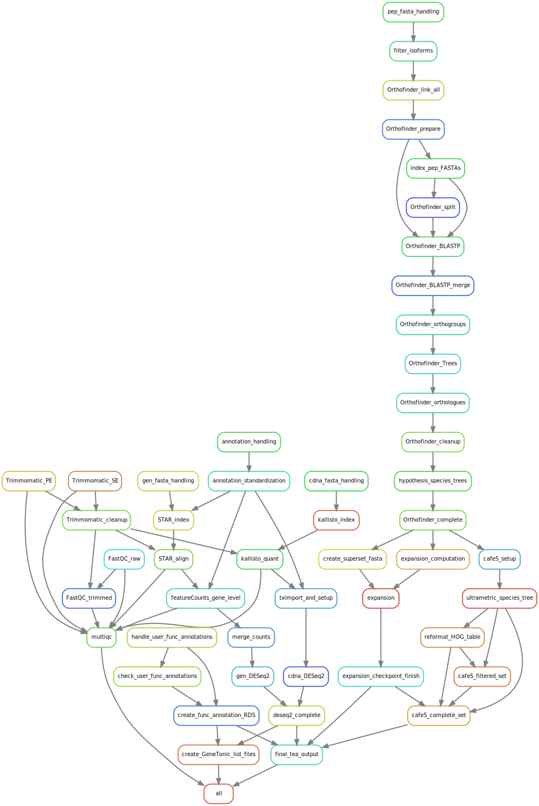

# A2TEA
Automated Assessment of Trait specific Evolutionary Adaptations

This workflow combines RNA-seq analyses, differential gene expression, with evolutionary analyses - most notably gene family expansion events.
We use Orthofinder2 to infer gene duplication events and correlate these with significant physiological reaction patterns in the compared species.

((Transcriptome assemblies -> AHRD annotation also possible...))

# Setup:
Install the Python 3 version of Miniconda.
you can get it here: https://docs.conda.io/en/latest/miniconda.html

Answer yes to the question whether conda shall be initialized and put into your PATH.

Then, you can install [mamba](https://github.com/QuantStack/mamba) (a faster replacement of conda in C++) with:

`conda install -c conda-forge mamba`

Download/Clone the current release of the A2TEA workflow into the directory.

The included environment.yaml file can be used to install all required software into an isolated Conda environment with a name of your choice - in the following we will call it "A2TEA":

`mamba env create --name A2TEA --file environment.yaml`

Activating the environment
To activate the snakemake-tutorial environment, execute

`conda activate A2TEA`

Now you can use the installed tools and our workflow without any software dependency issues.
For detailed options of snakemake see: https://snakemake.readthedocs.io/en/v5.5.1/executable.html

Should you want to remove the conda environment, execute
`conda env remove -n A2TEA`  

# General usage
## Recommended steps
1) Add fasta, annotation and fastq files to the input directories:  
  FASTAs and GTFs -> FS  
  FASTQ files -> rawreads  

2) Modify species.tsv and samples.tsv files
-> only when using cDNA FASTA and single-end reads for a species you NEED to add information to the fragment_length_mean column (single-end read length) as well as the standard deviation to the samples.tsv file  

3) Using the activated environment perform a dry-run and check for problems with:    
`snakemake --snakefile Snakemake_complete -np`  

4) Configure the config.yaml file to your needs  

5) Run A2TEA with (exchange XX for the amount of cores you can offer):  
`snakemake --snakefile Snakemake_complete --cores XX`  

# Some additional important pointers on usage:
1) Keep/add the "FS/" before the files in the species.tsv table 
2) Do NOT provide both a cDNA and genome fasta for a given species in the species.tsv file!  
  However using cDNA fasta for one species and genome fasta for another is totally fine.  
3) If you are using a genome fasta please also provide annotation .gtf file.    
If you are using cDNA fasta then also URL to the the annotation file suffices.  
4) Peptide & genome FASTA as well as GTF files shouldn't be compressed; cDNA FASTA should be gzipped
5) Fastq files should also be gzipped

# To do:
- option for installation of all software and dependencies during runtime  
- combination analyses of diff. exp. and orthologous groups  
-> R shiny overlay(?) integrating the data (+ GO analysis?)  
- more cleanup:  
-> add more options to the config.yaml files (e.g. trimmomatic options) so that all can be changed modified there  
-> add snakemake internal report  
-> restructering of A2TEA to modular layout  
-> this incl. seperate yaml files for the softwares and tools   
-> move the STAR index log to the logs/ directory  
  
  
### The workflow in its current form:

